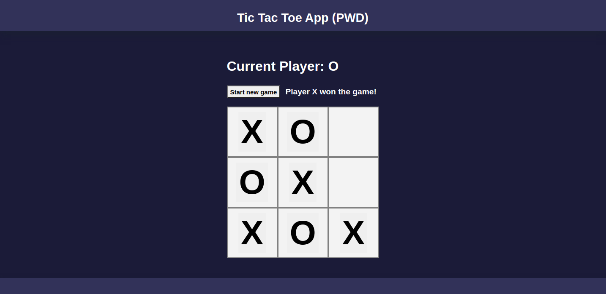

# Tic Tac Toe PWA App

App from video [Angular for Beginners - Let's build a Tic-Tac-Toe PWA](https://youtu.be/G0bBLvWXBvc).

This project was generated with [Angular CLI](https://github.com/angular/angular-cli) version 11.1.1.

Libs used:
- ng add @nebular/theme (Nebular - Customizable UI Kit, Auth & Security)
- ng add @angular/fire
- ng add @angular/pwa

Commands:
- ng build (can be done in nx console)
- ng deploy
- ng run tic-tac-toe-pwa:deploy (Firebase configured)

Live app:  
https://angular-e-firebase-45863.web.app/

## Development server

Run `ng serve` for a dev server. Navigate to `http://localhost:4200/`. The app will automatically reload if you change any of the source files.
